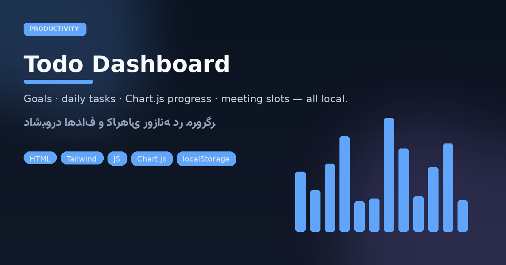
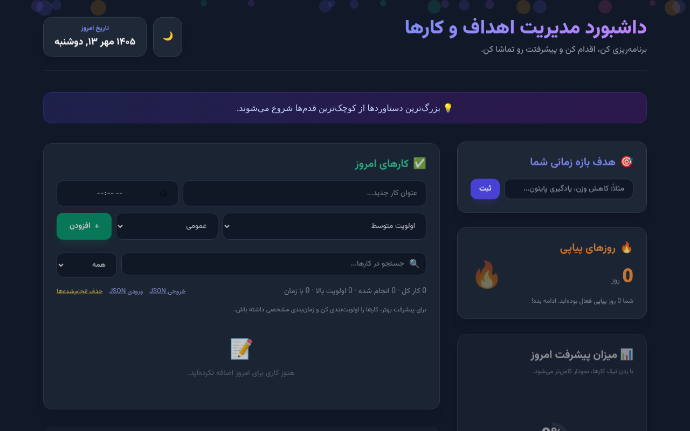

# Todo Dashboard
### Plan → act → watch the chart move

<p align="center"></p>
<p align="center"></p>

<p align="center">


</p>

Single-file **Persian RTL** productivity board — no build step, no backend. Goals, daily tasks with priority/category/time, streak counter, progress %, and meeting slots. Everything persists in `localStorage`.

## Open it

```bash
# just open in a browser
xdg-open index.html   # or double-click
# optional static server:
python3 -m http.server 8080 --directory .
```

## Surface map

| Zone | Job |
|------|-----|
| Today’s tasks | Add / filter / search / JSON import-export |
| Goal card | Time-bound objective |
| Streak | Consecutive active days |
| Progress | Chart.js-backed completion rate |
| Meetings | Slot planner alongside the day |

Dark theme + Vazirmatn. Designed for operators who want a dashboard that works offline on day one.

---

## فارسی — داشبورد Todo

یک **داشبورد مدیریت اهداف و کارهای روزانه** کاملاً سمت‌کلاینت: کارهای امروز با اولویت و دسته و ساعت، هدف بازه‌ای، روزهای پیاپی، درصد پیشرفت با Chart.js، و جایگاه جلسات. داده در `localStorage` می‌ماند — بدون سرور و بدون بیلد.

### اجرا

فایل `index.html` را در مرورگر باز کنید (یا با یک سرور استاتیک ساده سرو کنید).

### چرا این شکل؟

- فارسی و RTL از روز اول (فونت وزیرمتن)
- خروجی/ورود JSON برای پشتیبان‌گیری
- ظاهر مدرن تیره مناسب دموی محصول و استفاده شخصی

هیچ حساب کاربری و هیچ APIی لازم نیست؛ همان چیزی است که روی لپ‌تاپ تعمیرگاه یا میز کار دانشجویی باید فوری بالا بیاید.
