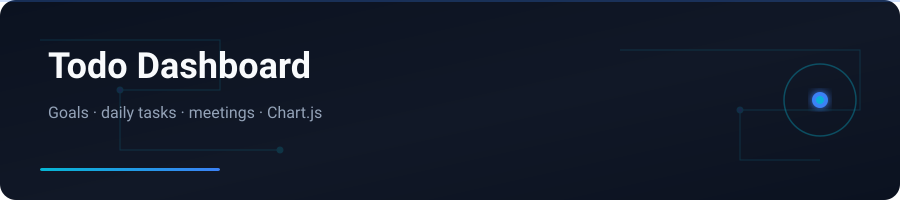

<div align="center">



</div>

# Todo Dashboard

Modern browser dashboard for goals, daily tasks, progress chart, and meeting slots — HTML, Tailwind CSS, JavaScript.

---

## English


### Features

- Set and edit a main goal
- Add / complete / delete daily tasks
- Live progress chart (Chart.js)
- Meeting list sorted by time
- Persists in `localStorage`

### Stack

HTML · Tailwind CSS · JavaScript · Chart.js

### Getting started

```bash
git clone https://github.com/yasinfallahati/todo.git
cd todo
# open index.html in a browser, or:
python3 -m http.server 8000
```

---

## فارسی

### داشبورد Todo

داشبورد مرورگری برای اهداف، کارهای روزانه، نمودار پیشرفت و جلسات — HTML، Tailwind و JavaScript.


### امکانات

- ثبت و ویرایش هدف اصلی
- افزودن / انجام / حذف کارهای روزانه
- نمودار پیشرفت لحظه‌ای (Chart.js)
- لیست جلسات مرتب‌شده بر اساس زمان
- ذخیره در `localStorage`

### تکنولوژی‌ها

HTML · Tailwind CSS · JavaScript · Chart.js

### شروع کار

```bash
git clone https://github.com/yasinfallahati/todo.git
cd todo
python3 -m http.server 8000
```
سپس `index.html` را باز کنید.

---

`#todo` `#dashboard` `#javascript` `#tailwindcss` `#chartjs` `#localstorage`
